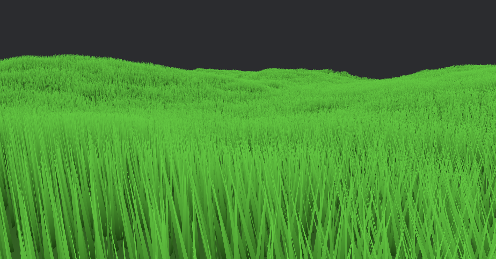

# Frosty Grass

**Frosty Grass** is a Rust crate that provides a simple plugin for the [Bevy](https://bevyengine.org/) game engine. The plugin renders simple grass on top of 3D meshes using GPU instancing.

## Features

- **GPU Instancing:** Leverage the power of GPU instancing for efficient rendering of a large number of grass instances.
- **Integration with Bevy:** Seamlessly integrate the grass renderer into your Bevy project with minimal setup.

## Planned Features

- Sampling grass properties from image maps
    - color
    - height
    - density

## Examples

- Run `cargo run --example grass_field` to see an example of randomly generated terrain covered in grass. Use `WASD` to move around, `QE` to turn, and `SPACE SHIFT` to go up and down.

## License

This crate is licensed under the MIT OR Apache-2.0 licenses

## Contributing

I welcome contributions! If you find any issues or have ideas for improvements, please open an issue or submit a pull request.

---
